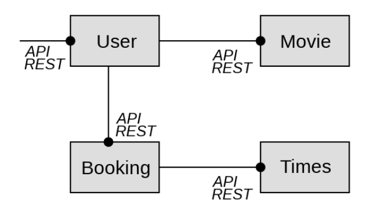

# UE-AD-A1-REST
Seul le tp vert a été effectué pour le tp REST. 

## TP VERT

### Introduction
L'objectif de ce TP est d'implémenter un ensemble de microservices permettant de gérer la réservation de films pour des utilisateurs (à l'image d'une salle de cinéma.
Quatre microservices sont implémentés:
- Movies : Fournie une banque de films 
- Showtime : Fournie une banque de séances disponibles pour différents films
- Booking : Gère les réservations de séances des utilisateurs
- User : Gère les utilisateurs et permet d'obtenir les informations de leurs réservations.

Les relations entre ces microservices sont les suivantes:

### Exécution des microservices
Pour rendre cet ensemble de microservices fonctionnels, il faut exécuter chacun des microservices séparément
(user.py, movie.py, booking.py, showtime.py).  
Il n'y a pas d'implémentation de conteneur docker.

### Particularités de ce TP
Chacun des microservices implémentés dans ce TP sont des API REST.   
Nous verrons les implémentations GraphQL et GRPC dans le prochain TP.

**Le détail des requêtes http effectuables avec chacun des services est consultable dans les fichiers yaml associés**
### Service Movie:
Ce service gère une banque de films. Plusieurs actions sont possibles:
- Récupérer tous les films de la banque de films
- Récupérer les informations d'un film spécifique à l'aide de son identifiant ou de son titre
- Supprimer un film de la banque
- Ajouter un film à la banque
- Modifier la note attribuée à un film 
### Service Showtime:
Ce service gère les séances disponibles. Il est possible de:
- Récupérer l'ensemble des séances disponibles
- Récupérer les films disponibles à une date précise

### Service Booking:
Ce service gère les réservations des utilisateurs. Il est possible de :
- Récupérer toutes les réservations enregistrées
- Récupérer les réservations d'un utilisateur
- Ajouter une réservation pour un utilisateur
- Supprimer la réservation d'un utilisateur
- Supprimer toutes les réservations d'un utilisateur
- Vérifier si une séance est disponible (Cette action serait plus cohérente dans le service showtime, mais nous l'avons implémenté ainsi)

### Service User:
Ce service gère les utilisateurs. Il est possible de:
- Récupérer l'ensemble des utilisateurs
- Récupérer un utilisateur avec son identifiant
- Ajouter un utilisateur
- Supprimer un utilisateur
- Récupérer les réservations d'un utilisateur
- Récupérer les informations des films réservés par l'utilisateur